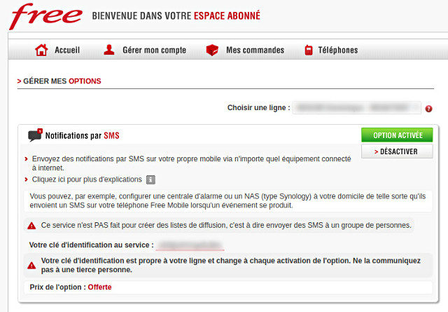

# Free Mobile <small>for Dart</small>
    


## Send SMS messages to your Free Mobile account
Send notifications to your own mobile device via any internet-connected device.

For example, you can configure a control panel or a network-attached storage to your home so that they send an SMS to your [Free Mobile](http://mobile.free.fr) phone when an event occurs.

## Quick start

!!! warning
    SMS notifications require an API key. If you are not already registered,
    [sign up for a Free Mobile account](https://mobile.free.fr/subscribe).

### Get an API key
You first need to enable the **SMS notifications** in [your subscriber account](https://mobile.free.fr/moncompte).
This will give you an identification key allowing access to the [Free Mobile](http://mobile.free.fr) API.

  

### Get the library
Append the following line to your project's `pubspec.yaml` file:

```yaml
dependencies:
  free_mobile: *
```

Install the latest version of **Free Mobile for Dart** with [Pub](https://dart.dev/tools/pub/cmd):

```shell
pub get
```

For detailed instructions, see the [installation guide](installation.md).
